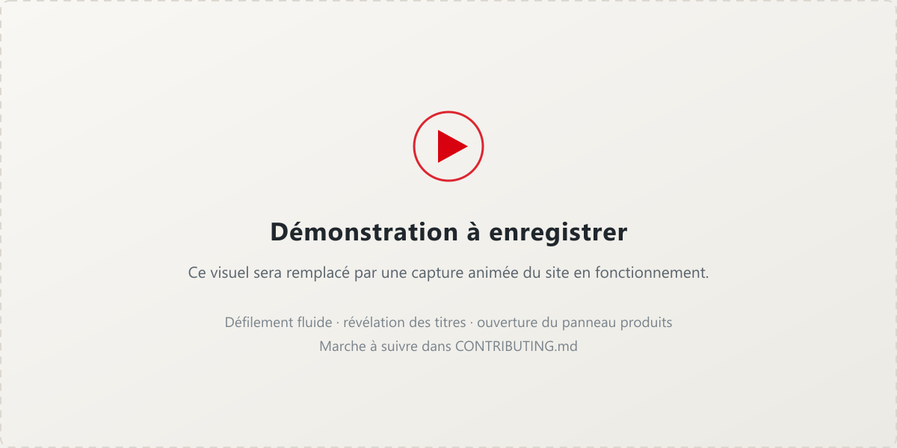
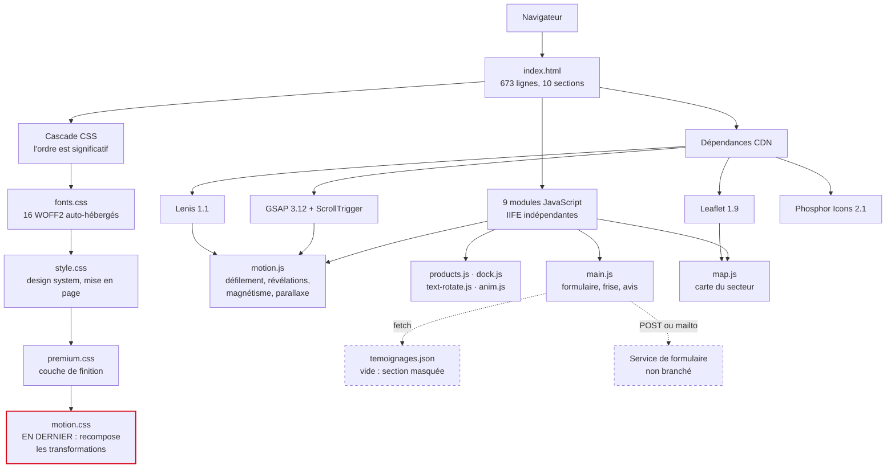

<div align="center">

<picture>
  <source media="(prefers-color-scheme: dark)" srcset="docs/media/banniere-sombre.svg">
  <source media="(prefers-color-scheme: light)" srcset="docs/media/banniere-claire.svg">
  
</picture>

<h1>Vera Nova</h1>

<p><strong>Site vitrine d'un poseur de pergolas bioclimatiques,<br>
écrit en HTML, CSS et JavaScript natifs — sans framework et sans étape de build.</strong></p>

<p>
  <a href="LICENSE"></a>
  <a href="../../actions/workflows/ci.yml"></a>
  
  
  
  
</p>

</div>

---

## Démonstration

<div align="center">
  
</div>

> [!NOTE]
> Ce visuel est un emplacement réservé. La capture animée n'a pas encore été
> enregistrée ; la marche à suivre est décrite dans
> [CONTRIBUTING.md](CONTRIBUTING.md).

---

## Pourquoi ce projet

Une entreprise qui vient de se créer n'a ni photos de chantier, ni avis
clients, ni budget publicitaire — mais ses concurrents en ont. Le site répond à
ce déséquilibre en misant sur ce qui ne demande pas d'antériorité : la clarté
de l'offre, la transparence des prix, et une exécution technique soignée.
L'objectif unique de la page est la **demande de devis locale**.

---

## Architecture



Chaque module JavaScript est une IIFE autonome qui **sort silencieusement si
son point d'ancrage est absent** de la page. Supprimer une section du HTML ne
casse donc jamais le reste du site.

---

## Démarrage rapide

Aucune dépendance à installer. Il faut simplement servir le dossier en HTTP :
la page charge des polices et un fichier JSON, que le protocole `file://`
bloque.

```bash
git clone https://github.com/Honzaaa45/vera-nova-pergolas.git
```

```bash
cd vera-nova-pergolas
```

```bash
npx --yes serve -l 5178 .
```

Le site est alors sur <http://localhost:5178>.

<details>
<summary><strong>Autres méthodes, et vérifications</strong></summary>

<br>

Si Node n'est pas installé, n'importe quel serveur statique convient :

```bash
python -m http.server 5178
```

Les trois vérifications que joue la CI, à lancer avant toute modification :

```bash
node tools/verifier-liens.mjs
```

```bash
npx --yes html-validate@9 index.html 404.html mentions-legales.html confidentialite.html
```

Et la syntaxe des modules, sous PowerShell :

```powershell
Get-ChildItem assets/js/*.js | ForEach-Object { node --check $_.FullName }
```

</details>

---

## Stack

| Domaine | Choix | Version | Chargement |
|---|---|---|---|
| Structure | HTML5 | — | — |
| Style | CSS natif, `grid` et `clamp()` | — | — |
| Scripts | JavaScript ES5, IIFE | — | — |
| Animation | GSAP + ScrollTrigger | 3.12.5 | CDN |
| Défilement | Lenis | 1.1.18 | CDN |
| Cartographie | Leaflet + tuiles CARTO | 1.9.4 | CDN |
| Icônes | Phosphor Icons | 2.1.1 | CDN |
| Polices | Sora + Manrope | — | auto-hébergées |

**Zéro dépendance npm en production.** Node n'intervient que pour les
vérifications de la CI.

<details>
<summary><strong>Arborescence commentée</strong></summary>

<br>

```
.
├── index.html                  page unique, 10 sections
├── mentions-legales.html       obligatoire en France, LCEN art. 6-III
├── confidentialite.html        notice RGPD
├── 404.html
├── robots.txt · sitemap.xml    référencement
│
├── assets/
│   ├── css/
│   │   ├── fonts.css           @font-face locaux
│   │   ├── style.css           design system et mise en page
│   │   ├── premium.css         couche de finition visuelle
│   │   └── motion.css          animation — SE CHARGE EN DERNIER
│   ├── js/
│   │   ├── motion.js           Lenis + GSAP : défilement, révélations
│   │   ├── products.js         panneau produits piloté au défilement
│   │   ├── text-rotate.js      titre à mots tournants
│   │   ├── dock.js             navigation de la barre haute
│   │   ├── anim.js             révélations, compteurs, parallaxe
│   │   ├── hero-marquee.js     ruban d'images
│   │   ├── premium.js          effets de finition
│   │   ├── main.js             formulaire, frise, témoignages
│   │   └── map.js              carte du secteur d'intervention
│   ├── fonts/                  16 WOFF2, 340 Ko
│   ├── img/gallery/            24 WebP : 12 photos en deux tailles
│   └── data/
│       └── temoignages.json    VIDE — voir « État d'avancement »
│
├── tools/
│   └── verifier-liens.mjs      contrôle des liens, sans dépendance
├── docs/
│   ├── deploiement.md          mise en ligne et référencement local
│   ├── contenu-du-site.md      dossier de reprise détaillé
│   └── media/                  bannières et image sociale
├── AGENTS.md                   règles du projet
└── .github/workflows/ci.yml
```

</details>

---

## Décisions techniques

<details open>
<summary><strong>1. Aucun framework, aucune étape de build</strong></summary>

<br>

Le site doit rester modifiable par son propriétaire, qui n'est pas
développeur. Un dépôt sans `node_modules` ni bundler s'ouvre dans n'importe
quel éditeur et se déploie en glissant un dossier.

**Alternative écartée :** Astro ou Next.js. Le rendu final aurait été
équivalent, mais la moindre modification de contenu aurait exigé une chaîne
d'outils fonctionnelle, et un projet qui ne se reconstruit plus dans deux ans
est un projet mort.

</details>

<details>
<summary><strong>2. GSAP plutôt que Framer Motion</strong></summary>

<br>

Framer Motion suppose React, donc un build, donc la décision n° 1 tombe. GSAP
et ScrollTrigger produisent les mêmes révélations au défilement en JavaScript
natif, chargés en deux balises `script`.

**Alternative écartée :** React et Framer Motion. Plus élégant à écrire, mais
aurait coûté tout le socle du projet pour un résultat visuel identique.

</details>

<details>
<summary><strong>3. Le parallaxe écrit une variable CSS, jamais un transform</strong></summary>

<br>

Les couches du bandeau d'accueil portent déjà leur propre transformation :
`translateZ(54px)` pour le médaillon, `translateZ(-28px) rotate(-7deg)` pour
les lames. Leur appliquer un `transform` via GSAP aurait **écrasé** cette
profondeur et aplati la scène.

`motion.js` n'écrit donc que la variable `--dy`, et `motion.css` la recompose
avec la transformation propre de chaque couche :

```css
.hero__badge { transform: translateZ(54px) translateY(var(--dy, 0px)); }
```

**Alternative écartée :** animer `y` directement avec GSAP. Plus court à
écrire, mais destructeur — c'est la raison pour laquelle `motion.css` doit
impérativement se charger en dernier.

</details>

<details>
<summary><strong>4. Polices auto-hébergées plutôt que Google Fonts</strong></summary>

<br>

Appeler le CDN de Google Fonts transmet l'adresse IP du visiteur à un serveur
tiers sans son consentement. Un tribunal allemand a condamné cette pratique en
2022 sur le fondement du RGPD. Les 16 fichiers WOFF2 pèsent 340 Ko, sont servis
depuis le même domaine, et suppriment au passage un aller-retour DNS.

**Alternative écartée :** un `link` vers `fonts.googleapis.com`. Une ligne au
lieu d'un dossier, mais un risque juridique réel sur un site commercial
français, et une dépendance réseau de plus.

</details>

<details>
<summary><strong>5. Les titres ne se masquent que si le script a démarré</strong></summary>

<br>

La révélation mot par mot suppose de masquer le titre avant de l'animer. Écrit
naïvement, cela donne `[data-split] { visibility: hidden; }` — et le jour où le
CDN est injoignable, **les six titres de la page disparaissent définitivement**.

Le masquage est donc conditionné à une classe que le script pose lui-même :

```css
.has-motion [data-split] { visibility: hidden; }
```

Un filet de sécurité complète le dispositif : passé un délai, tout élément déjà
dépassé par le défilement est forcé à son état final, en épargnant les couches
de parallaxe qu'un forçage ferait sauter.

**Alternative écartée :** masquer sans condition. Deux caractères de moins, et
une page vide au premier incident réseau.

</details>

---

## État d'avancement

**Fait et vérifié**

- Les 10 sections, la navigation, la carte du secteur, le titre à mots
  tournants.
- Couche d'animation : révélation des titres mot par mot, boutons magnétiques,
  inclinaison des cartes, parallaxe sur trois couches de profondeur.
- Pages légales, `robots.txt`, `sitemap.xml`, données structurées Schema.org
  `HomeAndConstructionBusiness` et `FAQPage`, avec 6 questions déclarées.
- Accessibilité : navigation au clavier, `prefers-reduced-motion` respecté
  partout, effets de survol désactivés sur écran tactile.
- CI verte sur trois contrôles réels : syntaxe des 9 modules, validité des 4
  pages, et 94 références locales vérifiées.

**En cours**

- Section « Avis » : le code est écrit et fonctionnel, mais `temoignages.json`
  est un tableau vide, donc la section reste `hidden`. Elle s'affichera dès que
  de vrais témoignages y seront ajoutés — aucun avis fictif n'a été écrit.
- Photographies : les 12 visuels viennent d'Unsplash et servent d'illustration,
  ce qui est déclaré dans les mentions légales. Ils devront céder la place à de
  vraies photos de chantier.

**Limites connues**

- Le formulaire n'a pas d'endpoint : `FORM_ENDPOINT` est vide et le code
  retombe sur l'ouverture d'un e-mail prérempli. Fonctionnel, mais dégradé.
- Les mentions légales comportent 12 champs `[À COMPLÉTER]` — SIRET, RCS,
  assurances décennale et RC pro. **Le site ne doit pas être mis en ligne en
  l'état : ces mentions sont une obligation légale.**
- Le prix affiché est un ordre de grandeur, pas un tarif confirmé.
- Les numéros de téléphone du dépôt sont des placeholders `0X XX XX XX XX`,
  volontairement : les vrais numéros n'ont pas à être exposés au moissonnage.
- La couche d'animation n'a pas pu être validée par capture automatisée ; elle
  l'a été par lecture des états calculés dans le navigateur.

---

## Licence

Code sous [licence MIT](LICENSE).

Ne sont **pas** couverts : la marque et le logo « Vera Nova », les
photographies issues d'[Unsplash](https://unsplash.com/license), et les polices
Sora et Manrope, sous SIL Open Font License 1.1.

## Auteur

**[@Honzaaa45](https://github.com/Honzaaa45)** — étudiant en BUT GEII, parcours
Automatisme et Informatique Industrielle.

Les remarques et les *pull requests* sont bienvenues : voir
[CONTRIBUTING.md](CONTRIBUTING.md).
